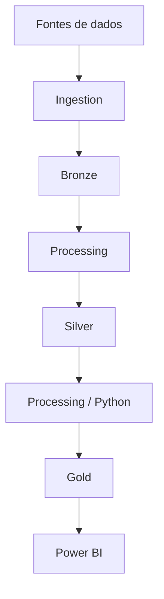

# Event-Driven Music Data Pipeline

**Status:** Em desenvolvimento local

## Objective

Projeto local de engenharia de dados para análise de dados musicais. Os CSVs são adicionados manualmente e percorrem as camadas da arquitetura Medalhão.

## Context

As fontes atuais são o **Spotify Music Dataset** e o **Music Features**. Os arquivos de origem são preservados na camada Bronze.

## Arquitetura Medalhão



Bronze preserva os dados recebidos. Silver concentra dados tratados e validados. Gold contém dados preparados para consumo analítico. Essas etapas ainda serão implementadas incrementalmente.

## Planned Data Sources

- Spotify Music Dataset
- Music Features

Os CSVs são fornecidos manualmente em `data/bronze/`.

## Project Structure

```text
architecture/  Diagramas e representações da arquitetura
data/          Camadas Bronze, Silver e Gold
ingestion/     Código de entrada dos dados
processing/    Processamento entre as camadas
analytics/     Consultas e análises
processing/    Transformações Python entre as camadas
powerbi/       Artefatos do Power BI
docs/          Documentação técnica
scripts/       Scripts auxiliares com função real
```

## Planned Technologies

| Technology | Planned purpose |
| --- | --- |
| Python | Automação e processamento local |
| CSV | Formato das fontes fornecidas manualmente |
| DuckDB | Exploração analítica local |
| Python | Processamento e transformações |
| Power BI | Visualização |

## Roadmap

1. Adicionar os datasets manualmente na camada Bronze.
2. Implementar ingestão e processamento incrementalmente.
3. Definir regras de validação para a camada Silver.
4. Adicionar modelos analíticos na camada Gold.
5. Definir o consumo pelo Power BI.

## Current Limitations

- Não há infraestrutura AWS, Snowflake ou outro serviço pago.
- A reorganização não altera os dados nem executa ETL ou profiling.
