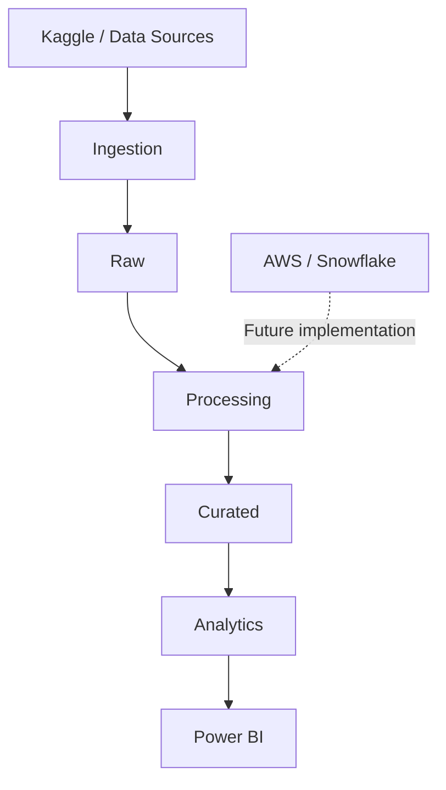

# Event-Driven Music Data Pipeline

**Status:** In Development

## Objective

This is a data engineering project focused on organizing and, in future phases, analyzing musical data. The repository is currently structural only: datasets will be added manually and no ingestion, processing, or analytical execution is implemented.

## Context

The project will work with two planned data sources: **Spotify Music Dataset** and **Music Features**. Their files, schemas, and data characteristics will be documented after manual addition and exploration.

## Architecture Target



The target flow separates source data, ingestion, processing, storage layers, analytical consumption, and visualization. AWS and Snowflake are future architecture options, not active integrations.

## Planned Data Sources

- Spotify Music Dataset
- Music Features

The CSV files will be supplied manually. No datasets are included in this repository.

## Project Structure

```text
data/          Raw, curated, and analytics data locations
ingestion/     Future data entry workflows
processing/    Future validation and transformation areas
storage/       Storage documentation and local conventions
analytics/     Future SQL and DuckDB analytical work
dbt/           Future analytical transformations
powerbi/       Future visualization assets
tests/         Unit, integration, and data quality tests
docs/          Technical documentation
scripts/       Future exploration and validation helpers
architecture/  Target architecture diagram
```

## Planned Technologies

| Technology | Planned purpose |
| --- | --- |
| Python | Future automation and processing |
| CSV | Manually supplied source format |
| DuckDB | Future local analytical exploration |
| dbt | Future analytical transformations |
| Power BI | Future visualization |
| AWS / Snowflake | Future cloud architecture options |

## Roadmap

1. Add the datasets manually.
2. Document source structure and provenance.
3. Define validation rules.
4. Implement ingestion and processing incrementally.
5. Add analytical SQL, DuckDB, and dbt models.
6. Define Power BI consumption requirements.
7. Evaluate future cloud, orchestration, and CI/CD components.

## Current Limitations

- No CSV or other dataset files are included.
- No profiling, transformations, pipeline functions, downloads, cloud integrations, Snowflake objects, or dashboards are implemented.
- Dependencies are intentionally not defined until implementation begins.
- Documentation contains placeholders where dataset-specific information is required.
